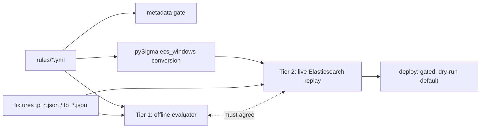

# SigmaForge

**Detection-as-code, taken literally.** A Sigma rule repository where every
detection rule is treated like production software: parsed, unit tested
against attack and benign event samples, converted to an Elasticsearch
query with the real backend, replay tested against a live cluster, and
deployed through a gated CI pipeline. A rule that cannot prove it fires
on the attack and stays silent on the lookalike does not merge.

```
$ make test
175 passed in 0.36s        # every rule vs every fixture, no Docker

$ make test-all
183 passed in 3.94s        # same fixtures replayed through a live Elasticsearch
```

## Why this exists

Most detection repos are YAML files and good intentions. The failure
modes are always the same: rules that never fired in testing, rules that
page the on-call for every backup job, and conversion pipelines that
silently mangle logic on the way to the SIEM. SigmaForge attacks all
three with the same idea: **a detection rule is an artifact that must be
reviewable, testable, and explainable**, and the repository's job is to
make the wrong way harder than the right way.

## The two tier testing model



**Tier 1** is a pure Python Sigma evaluator ([sigmaforge/evaluator.py](sigmaforge/evaluator.py))
that walks pySigma's parsed condition tree and evaluates rules directly
against JSON events. It implements Sigma's full matching semantics:
case-insensitive equality, `contains`/`startswith`/`endswith`, regex,
`base64`/`base64offset`, `cidr`, numeric comparisons, `windash` dash
variants, wildcards, null handling, keyword search, and every condition
form (`and`/`or`/`not`, parentheses, `1 of selection_*`, `all of them`).
It has its own 45-test suite because everything else trusts it. The
whole tier runs in well under a second, so it gates every commit.

**Tier 2** converts each rule to a Lucene query with the real
`pySigma-backend-elasticsearch` + `ecs_windows` pipeline, indexes the
same fixture events into a live Elasticsearch the way Winlogbeat would
ship them, runs the query, and asserts the hit set is **exactly** the
true positive fixtures. Not a superset. Exactly.

Both tiers share the same fixture files on purpose. If they ever
disagree, the test fails loudly and prints both results side by side:

```
fixture                                  expected  tier1  tier2
fp_backup_retention                         False  False   True
fp_vssadmin_list                            False  False   True
tp_vssadmin_quiet                            True   True   True
tp_wmic_shadowcopy                           True   True   True

TIER 1 / TIER 2 DIVERGENCE on ['fp_backup_retention', 'fp_vssadmin_list']:
the offline evaluator and the converted Elasticsearch query disagree.
The conversion pipeline (or the evaluator) has a bug.
```

That divergence signal is the single most useful thing this repo
produces: it means the logic you reviewed is not the logic your SIEM is
running.

## What a rule looks like here

Every rule ships with a false positive story, and the FP fixtures are
benign events that a naive version of the rule would catch:

```yaml
detection:
    selection_vssadmin:
        Image|endswith: '\vssadmin.exe'
        CommandLine|contains|all: ['delete', 'shadows']
    selection_wmic:
        Image|endswith: '\wmic.exe'
        CommandLine|contains|all: ['shadowcopy', 'delete']
    filter_backup_software:
        ParentImage|startswith:
            - 'C:\Program Files\Veeam\'
            - 'C:\Program Files\Microsoft Data Protection Manager\'
            - 'C:\Program Files\Veritas\'
    condition: 1 of selection_* and not filter_backup_software
```

Run against a live cluster, the ransomware precursor alerts and the
byte-for-byte identical command from a backup suite does not:

```
events indexed: 2 (one ransomware precursor, one Veeam backup cleanup)
query returned: 1 hit(s)
  ALERT -> tp_vssadmin_quiet
          command_line: vssadmin.exe delete shadows /all /quiet
          parent:       C:\Windows\System32\cmd.exe
```

Delete the `filter_backup_software` clause and CI tells you precisely
what you broke:

```
FAILED test_rule[shadow_copy_deletion-fp_backup_retention]
AssertionError: Rule shadow_copy_deletion.yml MATCHED false positive
fixture fp_backup_retention. The rule would fire on this benign activity.
```

## The gates

| Gate | What it rejects |
| --- | --- |
| Metadata (97 checks) | missing UUIDs, duplicate IDs, "Unknown" as the FP story, fake ATT&CK technique IDs, tactic tags that are not real tactics, missing references |
| Tier 1 rules | any rule that misses a `tp_` fixture or fires on an `fp_` fixture |
| Fixture convention | rules with no fixtures, no TP fixture, or no FP fixture. A rule without a false positive test is not a tested rule |
| Tier 2 integration | rules whose converted query returns anything other than exactly the TP set |
| Coverage freshness | PRs that change rules without regenerating `docs/coverage.md` |

Every failure message names the rule file and the specific problem.

## Current coverage

8 rules across 7 tactics (MITRE ATT&CK v19.1), generated by
`make coverage` into [docs/coverage.md](docs/coverage.md) and an
[ATT&CK Navigator layer](docs/navigator_layer.json):

| Tactic | Techniques |
| --- | --- |
| command-and-control | T1105 Ingress Tool Transfer |
| credential-access | T1003.001 LSASS Memory |
| execution | T1059.001 PowerShell |
| impact | T1490 Inhibit System Recovery |
| persistence | T1053.005 Scheduled Task, T1543.003 Windows Service, T1547.001 Run Keys |
| privilege-escalation | T1053.005, T1055 Process Injection, T1543.003 |
| stealth | T1055, T1059.001 |

The generated doc also lists every tactic with **zero** coverage.
Honest gaps beat imaginary coverage.

## Quickstart

```bash
make install     # venv + exact-pinned dependencies
make test        # Tier 1: evaluator, metadata gate, rule tests (< 1s)
make up          # Elasticsearch 8.19.3 + Kibana, single node, memory capped
make test-all    # everything, including Tier 2 replay
make new-rule NAME=my_rule    # scaffold a rule + fixture templates
make convert RULE=rules/windows/shadow_copy_deletion.yml
make deploy      # dry run; --push required to write, ELASTIC_URL required to push
```

Requires Python 3.11+, Docker, and make. Tested on Linux, macOS, and
Windows.

## Design decisions worth knowing about

**The evaluator walks pySigma's AST instead of reimplementing Sigma.**
pySigma already parses conditions into an
`AND`/`OR`/`NOT`/`FieldEqualsValue` tree with all modifiers folded into
typed leaf values. Tier 1 walks that tree, so rule parsing can never
disagree between tiers by construction. Matching semantics were chosen
to mirror the Lucene backend where Sigma leaves room: `re` is anchored
(Lucene `field:/regex/` is anchored), keywords are substrings (Lucene
renders unbound values as `*value*`).

**The event mapper is extracted from the pipeline, not copied.** Tier 2
must index fixtures with the same Sysmon-to-ECS field mapping the rule
conversion uses. Instead of maintaining a parallel mapping table,
[sigmaforge/convert.py](sigmaforge/convert.py) reads the mapping out of
the installed `ecs_windows` pipeline object at runtime. It cannot drift.

**The metadata gate validates against real ATT&CK data.** Technique and
tactic tags are checked against pySigma's bundled MITRE dataset, not a
regex. This caught a real issue during development: ATT&CK v19 replaced
the defense-evasion tactic, and the gate rejected the stale tag.

**Deploys are dry-run by default.** `python -m sigmaforge.deploy`
prints what would ship. Writing requires both `--push` and an explicit
`ELASTIC_URL`, and the CI deploy job only runs on main behind a
protected environment. Nobody ships to a live SIEM from a fork by
accident.

**Scaffolding makes the right way the lazy way.** `make new-rule`
generates the rule skeleton with a fresh UUID plus tp_/fp_ fixture
templates. The scaffold deliberately fails the gates until the
detection logic, FP story, and fixtures contain real content.

## Repository layout

```
rules/windows/                 one YAML per rule
tests/fixtures/<os>/<rule>/    tp_*.json / fp_*.json, one event each
sigmaforge/                    evaluator, loader, convert, deploy, coverage, scaffold
tests/                         evaluator suite, metadata gate, Tier 1, Tier 2
docs/                          generated coverage.md + navigator_layer.json
.github/workflows/ci.yml       test -> integration -> deploy
```

## CI

Three jobs in [.github/workflows/ci.yml](.github/workflows/ci.yml):

1. **test**: ruff, evaluator suite, metadata gate, Tier 1 rule tests,
   coverage doc freshness.
2. **integration**: Elasticsearch service container, `pytest --integration`.
3. **deploy**: main only, gated by a `production` environment with
   `ELASTIC_URL`/`ELASTIC_API_KEY` secrets.

Recommended branch protection for `main` (Settings -> Branches): require
a PR with one approval, require the `test` and `integration` checks,
require branches up to date, no bypass. Add required reviewers on the
`production` environment so every deploy has a human in the loop.

## Contributing

See [CONTRIBUTING.md](CONTRIBUTING.md) for the submission checklist. The
PR template asks three questions: what technique, what is the FP story,
and what did you test it against. If those are hard to answer, the rule
is not ready.
